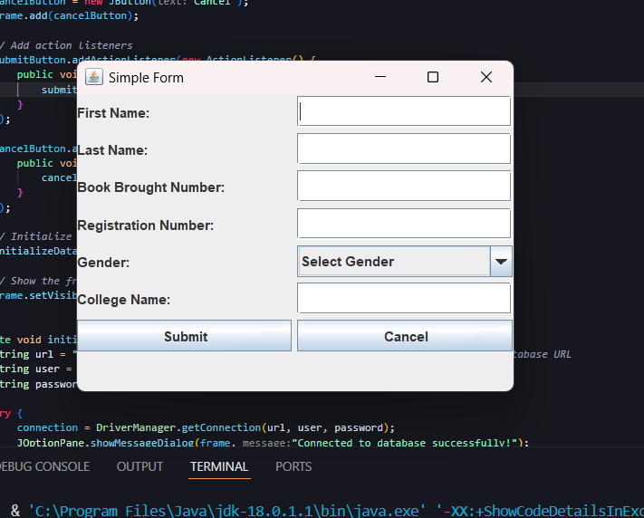

# Simple Java Swing Form with MySQL Database Integration 

This project demonstrates a simple Java Swing form for capturing user data, such as first name, last name, book number, registration number, and college name. It also includes MySQL integration to store the captured data in a database.

## Features
- Java Swing Form
- MySQL Database Integration
- Form Validation
- Data Submission

## Preview


## Prerequisites
Before running the application, make sure you have the following installed:
- Java 8 or above
- MySQL Server
- MySQL Connector/J

## Getting Started

### Step 1: Install MySQL Server
1. Download MySQL Server from the official website: [MySQL Downloads](https://dev.mysql.com/downloads/).
2. Install MySQL Server and note down your MySQL root password.

### Step 2: Start MySQL Server
1. Open the Command Prompt (Windows) or Terminal (macOS/Linux).
2. Navigate to the MySQL Server's `bin` directory. For example:
    - **Windows:**
      ```bash
      cd C:\Program Files\MySQL\MySQL Server 8.0\bin
      ```
3. Run the MySQL command line client:
    ```bash
    mysql -u root -p
    ```
4. Enter the root password when prompted.

### Step 3: Create Database and Table
1. Create a new database:
    ```sql
    CREATE DATABASE testdb;
    ```

2. Use the newly created database:
    ```sql
    USE testdb;
    ```

3. Create the `students` table:
    ```sql
    CREATE TABLE students (
        id INT AUTO_INCREMENT PRIMARY KEY,
        first_name VARCHAR(50),
        last_name VARCHAR(50),
        book_brought_number INT,
        registration_number INT,
        gender VARCHAR(10),
        college_name VARCHAR(100)
    );
    ```

### Step 4: Download MySQL Connector/J
1. Download MySQL Connector/J from the following link: [MySQL Connector/J Download](https://dev.mysql.com/downloads/connector/j/).
2. Extract the `.zip` file and locate the `.jar` file, for example, `mysql-connector-j-8.0.27.jar`.

### Step 5: Set Up the Java Project in VS Code

1. Open your project in **Visual Studio Code** (VS Code).
2. In the **Explorer** panel, locate the `lib` folder (create one if it doesn't exist).
3. Copy the `mysql-connector-j-8.0.27.jar` file to the `lib` folder.
4. In **VS Code**, open the **Java Projects** view on the bottom left side.
5. Right-click on **Referenced Libraries** under your project and select **Add External JARs**.
6. Choose the `mysql-connector-j-8.0.27.jar` file you just copied into the `lib` folder.

### Step 6: Run the Java Application

1. In **VS Code**, navigate to your `SimpleForm.java` file.
2. Right-click the file and select **Run Java**.
3. Your application should now launch, and you'll be able to enter data in the form. Upon clicking **Submit**, the data will be saved in the MySQL database **cancel** doesn't work.

## Troubleshooting

- If the MySQL connection fails, make sure that the MySQL server is running and that you've entered the correct credentials in your Java code.
- Ensure that the MySQL Connector/J `.jar` file is correctly added to the project’s classpath (through the **Referenced Libraries** section).

## License

This project is licensed under the MIT License - see the [LICENSE](LICENSE) file for details.
